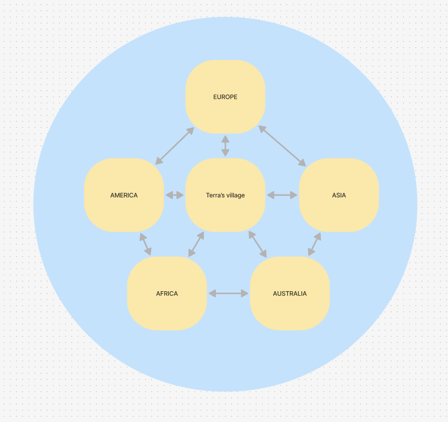

# <p style="text-align:center;"> <a style="color:lightgreen">Project 2 Serious Game: TERRA's Adventures</a></br> <a style="color:green; font-size: 36px">Functional Specification</a></br><a style="color:orange"> ALGOSUP - Team 4</a></p> 

<details>

**<summary>Team Members</summary>**
| Name             | Picture                                                                                     | Role               | LinkedIn                                                      | GitHub                                           |
|------------------|---------------------------------------------------------------------------------------------|--------------------|---------------------------------------------------------------|--------------------------------------------------|
| Julian Reine     |   | Project Manager    | [LinkedIn Profile](https://www.linkedin.com/in/julian-reine-b2952632a) | [GitHub Profile](https://github.com/JulianREINE) |
| Ian Laurent      |   | Program Manager    | [LinkedIn Profile](https://www.linkedin.com/in/ian-h-laurent/)         | [GitHub Profile](https://github.com/Ianlaur)       |
| Raphaël Chiocchi |   | Software Engineer  | [LinkedIn Profile](https://www.linkedin.com/in/rapha%C3%ABl-chiocchi-50169632a/)  | [GitHub Profile](https://github.com/Raphaneuil?tab=following)     |
| Mariem Zaiane    |   | Technical Lead     | [LinkedIn Profile](https://www.linkedin.com/in/mariem-zaiane-2b2165225)     | [GitHub Profile](https://github.com/Mariem-Zaiane)      |
| Terra Chinsy   |   | Technical Writer   | [LinkedIn Profile](https://www.linkedin.com/in/Terra-chinsy-5a794632b/)    | [GitHub Profile](https://github.com/TerraChinsy)     |
| Mathis Pascucci  |   | Quality Assurance  | [LinkedIn Profile](https://www.linkedin.com/in/mathis-pascucci-8b759732a/)   | [GitHub Profile](https://github.com/Mathis441)      |
</details>

<details>

**<summary> Table of content</summary>**


1. [Introduction](#1-introduction)

    [1.1 Project Overview](#11-project-overview)

    [1.2 Purpose of the Document](#12-purpose-of-the-document)

    [1.3 Scope of the Project](#13-scope-of-the-project)

    [1.4 Objectives and Goals](#14-objectives-and-goals)

    [1.5 Stakeholders](#15-stakeholders)


2. [Project Description](#2-project-description)

    [2.1 Problem Statement](#21-problem-statement)

    [2.2 Solution Overview](#22-solution-overview)

    [2.3 Key Features and Functionalities](#23-key-features-and-functionalities)

    [2.4 Assumptions and Dependencies](#24-assumptions-and-dependencies)

3. [Functional Requirements](#3-functional-requirements)

    [3.1 System Requirements](#31-system-requirements)

4. [System Architecture and Design](#4-system-architecture-and-design)

    [4.1 Overall System Architecture](#41-overall-system-architecture)

    [4.2 Modules and Components](#42-modules-and-components)

    [4.3 User Interface (UI) Design (Responsiveness, Player-Centric Design...)](#43-user-interface-ui-design-responsiveness-player-centric-design)

5. [User Interaction and Design](#5-user-interaction-and-design)

    [5.1 User Interface Requirements](#51-user-interface-requirements)

    [5.2 User Journey and Use Case Diagrams](#52-user-journey-and-use-case-diagrams)

    [5.3 Mockups or Wireframes (W.I.P.)](#53-mockups-or-wireframes-wip)

6. [Performance Requirements](#6-performance-requirements)

    [6.1 Speed and Latency](#61-speed-and-latency)

    [6.2 Scalability](#62-scalability)

    [6.3 Reliability and Availability](#63-reliability-and-availability)

7. [Security Requirements](#7-security-requirements)

    [7.1 Licence](#71-licence)

    [7.2 Compliance with Standards](#72-compliance-with-standards)

8. [Testing and Validation](#8-testing-and-validation)

    [8.1 Test Plan Layout](#81-test-plan-layout)

    [8.2 Functional Testing Scenarios](#82-functional-testing-scenarios)

    [8.3 Non-functional Testing Scenarios (load testing, security testing...)](#83-non-functional-testing-scenarios-load-testing-security-testing)


9. [Deployment and Maintenance](#9-deployment-and-maintenance)

    [9.1 Deployment Strategy](#91-deployment-strategy)

    [9.2 Maintenance Plan](#92-maintenance-plan)

    [9.3 Public Documentation](#93-documentation-and-training-requirements)

10. [Appendices](#10-appendices)

    [10.1 Glossary of Terms](#101-glossary-of-terms)

    [10.2 References](#102-references)

    [10.3 Supporting Documents](#103-supporting-documents)

</details>


## 1. introduction


### 1.1 Project overview
This project involves the development of a serious educational game designed to teach players about climate change and its environmental impacts. The game will focus on key concepts such as global warming, the role of, carbon footprints, and the importance of sustainable practices. Set in a miniature world divided by 5 different zones inpired by 5 different continents (America, Asia, Europe, Africa, Australia) each representing one critical climate issue, the player will explore these five zones following the paths of the main character named Terra. Through interactive gameplay, players will gain a deeper understanding of how human activities contribute to climate change and how making informed, eco-conscious decisions can help mitigate its effects.

The game’s goal is to provide a fun and engaging platform for learning complex climate science topics. It will target a diverse audience, offering tailored experiences to different user groups, such as middle school students, urban adults, and even political leaders in developing countries. The game is intended to serve as both an educational tool and a catalyst for real-world behavior change, fostering greater awareness and action around climate change.

### 1.2 Purpose of the Document
The purpose of this document is to outline the functional specifications for the development of an educational game focused on climate change. It will serve as a guide for the development process, detailing the features, requirements, and design principles necessary for creating a game that is both educational and engaging. This document defines the scope and objectives of the game, establishes clear functional and non-functional requirements, and provides direction on the system architecture, user interface, and user experience. The goal is to ensure that all aspects of the game are well-defined and aligned with the overall educational mission, meeting the expectations set by the project overseer, such as Franck JEANNIN, our school principal.

### 1.3 Scope of the Project
The scope of this project includes the development of an educational game designed to teach players about climate change, focusing on key environmental concepts such as global warming, greenhouse gases, and carbon footprints. The game will feature an interactive narrative where players learn about sustainability and eco-friendly practices through the journey of a central character, Terra, which is a direct reference to the latin word "Terra" which means earth.

**Key aspects of the project include:**

- **Game Development:** Design, implementation, and testing of the game using the Godot game engine.
- **Educational Content:** The game will integrate key climate change topics such as global warming, the impact of human activities on the environment, and actions that can mitigate climate change. These foundational topics will be woven into the gameplay to ensure that players not only enjoy the game but also learn valuable information about sustainability and environmental stewardship.
- **Target Audience:** The game will be designed to cater to middle school students, urban adults, and even policymakers, with content adaptable for these different groups. This will allow people to have a clear understanding of the impact they can have to reduce climate change through simple actions. This game is a call to action to bring a change to the environmental issues that we are facing today.
- **Interactivity:** Players will engage in tasks such as planting trees and finding sustainable energy solutions. Each decision will impact the virtual environment, making it more pleasant as sustainable choices are made.
- **Platform:** The game will be designed for web browsers, running on the Godot engine, and accessible via the itch.io platform. This decision aims to maximize audience reach and ensure global accessibility through the internet.

**Out of scope:**

- While planting trees around the play areas and other eco-friendly actions will be included in the game, they will be presented as part of a broader educational context on sustainability and climate change, rather than as the primary focus.

- The game will not include multiplayer modes or complex real-time simulations.

- No external funding is involved, and the project will be developed strictly as an educational project for ALGOSUP SAS.

### 1.4 Objectives and Goals
The primary objective of this project is to create an educational game that raises awareness about climate change and sustainability. Through an interactive narrative, players will explore environmental issues by following the journey of the main character, Terra. The player's decisions throughout the game will determine the finality of the game and attribute a certain scoring to the player. The main goals are as follows:

- **<u>Raise Awareness:</u>** Educate players about the science of climate change, including global warming, greenhouse gases, and the environmental impact of human activities, all through the lens of the character’s experience.

- **<u>Promote Action:</u>** Encourage players to take responsibility for their actions by showing how small, everyday decisions can affect the environment. Through Terra's journey, players will be inspired to make sustainable choices, such as opting for alternative ways to produce energy and minimizing waste.

- **<u>Engage through Interactive Storytelling:</u>** Using Terra’s character development this will create an emotional connection with players. As they help Terra to learn and grow, players will become more engaged with the educational content and motivated to adopt sustainable behaviors themselves.

- **<u>Empower Decision-Making:</u>** Enable players to see the consequences of their actions as they guide Terra through various scenarios. This will help players understand the long-term impact of their decisions on the environment and give them a sense of agency in tackling climate change.

By achieving these goals, the game will aim to foster a deeper understanding of climate change, while also empowering players to take actionable steps toward sustainability, inspired by the personal growth of the central character, Terra.

### 1.5 Stakeholders

The key stakeholders for this project are:

- **<u>Franck JEANNIN</u>** (School Principal): As the principal, Franck JEANNIN is the client who assigned the project to the school. He will be the primary recipient of the final product and will assess whether it meets the educational objectives set for the project.

- **<u>Teachers and Educators:</u>** Teachers are guiding the team through the learning process, specifically helping with mastering game design and assisting in preparing the team for the final project presentation to Franck JEANNIN and the jury. They provide crucial support for the technical and presentation aspects of the project.

- **<u>Potential Future Partners (e.g. Environmental Organizations):</u>** In the future, the game could expand to partner with environmental organizations, NGOs, or other schools that focus on climate education and advocacy.

## 2. Project Description

### 2.1 Problem Statement
Climate change is one of the most urgent challenges the world faces today. While most people are aware of it, many still struggle to fully understand the science behind it or why it’s so important. Key concepts like greenhouse gases, carbon footprints, and overconsumption of resources can be difficult to grasp, especially for younger audiences or those not familiar with environmental issues.

Traditional teaching methods often fail to make these complex ideas relatable or engaging. As a result, people may not realize how their everyday actions—such as driving a car, wasting food, or using energy—affect the environment. Without a clear understanding of the problem, it’s hard for individuals to feel motivated to change their habits.

To tackle this, there’s a need for a new approach: one that makes learning about climate change not only informative but also engaging. A serious game offers a unique opportunity to present these important concepts in a way that’s interactive and fun. By directly involving players in decision-making and showing the impact of their actions on the environment, the game will be their call for action which can help them understand the gravity of the situation and inspire real-world change.

### 2.2 Solution Overview
The game is designed to provide an interactive way for players to learn about climate change and its environmental impacts. Through the story of Terra, players will experience how everyday actions contribute to larger environmental issues. By making choices and seeing their outcomes, players will understand how their actions can have a positive or negative impact on the planet.
Developed using Godot, the game will blend educational content with engaging gameplay to make complex topics more accessible. Players will explore real-world challenges and solutions in a virtual environment, gaining a deeper understanding of climate change and how they can contribute to a sustainable future by following Terra's journey through a miniature world inspired by five continents.

### 2.3 Key Features and Functionalities

The game will offer a series of interactive features that aim to engage players while teaching them about climate change. The key functionalities include:

1.	**<u>Character-driven Narrative:</u>** Players will follow the journey of Terra, who learns about environmental sustainability through everyday decisions. His story will guide the player through different aspects of climate science, making the concepts relatable and engaging.

2.	**<u>Decision-making and Consequences:</u>** Throughout the game, players will be presented with choices that affect the environment and the progression of the story. These decisions will illustrate the real-world impact of actions such as waste management, energy consumption, and resource use.

3.	**<u>Exploration of Different Scenarios:</u>** Players will navigate various environments, such as Terra's village and community projects, where they can engage in activities like, leaning how to plant trees to help reforest the village and adopting renewable energy practices.

4.	**<u>Feedback Mechanism:</u>** The game will provide feedback on player decisions, showing how each choice contributes to or mitigates climate change. This feedback will help reinforce the importance of each action in real-world environmental contexts.

5.	**<u>Educational Content Integration:</u>** Key concepts such as carbon footprints, greenhouse gases, and sustainable practices will be integrated into the gameplay, helping players understand how their everyday behaviors can impact the environment.

6.	**<u>Progressive Learning:</u>** As the game progresses, the complexity of the challenges will increase, offering deeper insights into climate change science and solutions. The goal is to keep players engaged while continuously expanding their understanding of the topic.

These features combine to create an immersive learning experience that makes complex environmental concepts more accessible and actionable for players.

### 2.4 Assumptions and Dependencies
When developing this game, there are a few key assumptions and dependencies that the team considered:

1.	Basic Understanding of Climate Change: We assume that players have a general awareness of climate change and environmental issues. The game is meant to expand on this knowledge, but having a basic understanding helps players engage more deeply with the content and ease the gameplay.

2.	Access to Devices: The game assumes players will have access to a web browser and internet. This includes having the necessary hardware and software to run the game smoothly.

## 3. Functional Requirements

### 3.1 System Requirements
#### Minimum System Requirements

| **Category**           | **Specification**                                                                                   | **Example**                                   |
|-------------------------|-----------------------------------------------------------------------------------------------------|-----------------------------------------------|
| **CPU (Windows)**       | x86_32 CPU with SSE2 instructions, any x86_64 CPU, ARMv8 CPU                                       | Intel Core 2 Duo E8200, AMD Athlon XE BE-2300, Snapdragon X Elite |
| **CPU (macOS)**         | x86_64 or ARM CPU (Apple Silicon)                                                                   | Intel Core 2 Duo SU9400, Apple M1             |
| **GPU (Forward+)**      | Integrated graphics with full Vulkan 1.0 support                                                   | Intel HD Graphics 5500 (Broadwell), AMD Radeon R5 Graphics (Kaveri) |
| **GPU (Mobile)**        | Integrated graphics with full Vulkan 1.0 support                                                   | Intel HD Graphics 5500 (Broadwell), AMD Radeon R5 Graphics (Kaveri) |
| **GPU (Compatibility)** | Integrated graphics with full OpenGL 3.3 support                                                   | Intel HD Graphics 2500 (Ivy Bridge), AMD Radeon R5 Graphics (Kaveri) |
| **RAM (Native Exports)**| 2 GB                                                                                               | —                                             |
| **RAM (Web Exports)**   | 4 GB                                                                                               | —                                             |
| **Storage**             | 150 MB (executable, project files, and cache)                                                      | —                                             |
| **Operating System**    | **Web Exports:** Firefox 79, Chrome 68, Edge 79, Safari 15.2, Opera 64 | —                                             |

#### Recommended System Requirements
  
| **Category**            | **Specification**                                                                                   | **Example**                                   |
|--------------------------|-----------------------------------------------------------------------------------------------------|-----------------------------------------------|
| **CPU (Windows)**        | x86_64 CPU with SSE4.2 instructions, 4+ physical cores, or ARMv8 CPU                               | Intel Core i5-6600K, AMD Ryzen 5 1600, Snapdragon X Elite |
| **CPU (macOS)**          | x86_64 or ARM CPU (Apple Silicon)                                                                   | Intel Core i5-8500, Apple M1                  |
| **CPU (Linux)**          | x86_32 CPU with SSE2 instructions, x86_64 CPU, ARMv7 or ARMv8 CPU                                   | Intel Core i5-6600K, AMD Ryzen 5 1600, Raspberry Pi 5 (overclocked) |
| **GPU (Forward+)**       | Dedicated graphics with full Vulkan 1.2 support                                                    | NVIDIA GeForce GTX 1050 (Pascal), AMD Radeon RX 460 (GCN 4.0) |
| **GPU (Mobile)**         | Dedicated graphics with full Vulkan 1.2 support                                                    | NVIDIA GeForce GTX 1050 (Pascal), AMD Radeon RX 460 (GCN 4.0) |
| **GPU (Compatibility)**  | Dedicated graphics with full OpenGL 4.6 support                                                    | NVIDIA GeForce GTX 650 (Kepler), AMD Radeon HD 7750 (GCN 1.0) |
| **RAM (Native Exports)** | 4 GB                                                                                               | —                                             |
| **RAM (Web Exports)**    | 8 GB                                                                                               | —                                             |
| **Storage**              | 150 MB (executable, project files, and cache)                                                      | —                                             |
| **Operating System**     |  **Web Exports:** Latest Firefox, Chrome, Edge, Safari, Opera | —                                             |

## 4. System Architecture and Design

### 4.1 Overall System Architecture
When the player launches the game for the first time, they will encounter a main menu with options to play or access settings. In the settings, players can adjust music volume, change keybinds, and customize other options to enhance their user experience. Upon pressing the play button, the game will begin, and the player character will appear in the center of the screen. The player can control the character using their chosen keybinds, pick up objects to add to their inventory (accessible via a designated key), and navigate the map. Throughout the game, the player will interact with NPCs and solve various challenges.

### 4.2 Modules and Components
#### Game Engine Module
This module will handle all the core functionalities of the game engine, including rendering, physics, and input handling. It will be responsible for managing the game loop and ensuring smooth gameplay.

#### User Interface Module
This module will manage all the UI elements, including menus, dialogs, inventory, pause button, and mini map. It will ensure that the UI is responsive and provides a seamless experience across different devices.

#### Gameplay Mechanics Module
This module will implement the core gameplay mechanics, such as character movements, interactions with objects and NPCs, and the decision-making system. It will also handle the logic for the various challenges and scenarios the player will encounter.

#### Audio Module
This module will manage all audio-related functionalities, including background music, sound effects, and voiceovers. It will ensure that the audio enhances the overall gaming experience.

#### Data Management Module
This module will handle the storage and retrieval of game data, such as player progress, settings, and inventory. It will ensure that data is saved and loaded efficiently.

#### Testing Module
This module will collect and analyze data on player behavior and game performance. It will provide insights that can be used to improve the game and enhance the player experience.

## 5. User Interaction and Design
### 5.1 User Interface
The in-game user interface will include:
- **Mini Map:** Displayed in the top left corner, showing the player's real-time position.
- **Hotbar:** Positioned at the bottom of the screen, displaying picked-up items. Customizable via the inventory.
- **Inventory:** Accessible with a dedicated key, showing all collected items. Hovering over items reveals their uses.
- **Pause Button:** Allows the player to pause the game, access settings, or quit.


### 5.2 User Journey

#### User Journey
The user journey outlines the steps a player will take from starting the game to completing it. This includes interactions with the game’s features and the progression through different levels and challenges.

1. **Game Start:**
    - Player launches the game and is greeted by the main menu.
    - Player selects "Play" to start the game.

2. **Introduction:**
    - The game begins with an introductory cutscene explaining the story and objectives.
    - Player is introduced to the main character, Terra, and the initial environment.

3. **Exploration and Learning:**
    - Player explores the game world, interacts with NPCs, and completes tasks.
    - Player learns about climate change concepts through in-game dialogues and activities.

4. **Decision-Making:**
    - Player makes choices that affect the game world and Terra’s journey.
    - Each decision has consequences that are reflected in the environment and storyline.

5. **Challenges and Quests:**
    - Player completes various challenges and quests related to sustainability and environmental practices.
    - Successful completion of tasks rewards the player with items or progress in the story.

6. **Feedback and Progress:**
    - The game provides feedback on the player’s decisions and actions.
    - Player can track progress through the game’s UI, including the mini map, air purity progression bar, and inventory.

7. **Game Completion:**
    - Player reaches the end of the game, where the outcomes of their decisions are summarized.
    - The game concludes with a final cutscene and a summary of the player’s impact on the virtual environment.


### 5.3 Mockups or Wireframes (W.I.P.)
<p style="text-align:center;">
    
    </br> [10]: UI: User interface
</p>

<p style="text-align:center;">
    
    </br> [11]: Inventory
</p>

<p style="text-align:center;">
    
    </br> [12]: Settings
</p>


## 6. Performance Requirements

### 6.1 Speed and Latency
The game must be fluid and free from lag to ensure a smooth and enjoyable user experience. Performance optimization techniques will be employed to minimize latency and maintain consistent frame rates across different devices and platforms. To achieve this, we have decided to go for a fixed FPS rate of 60 FPS (66 MFPS). This will help maintain a consistent performance level and provide a smooth gameplay experience for users.
### 6.2 Scalability

### 6.3 Reliability and Availability

## 7. Security Requirements

### 7.1 License

```markdown
The project is licensed under the MIT License. See the [LICENSE](../LICENSE) file for more details.
```

### 7.2 Compliance with Standards
The development team is evaluating the potential implementation of user profiles that include email addresses and other personal information. If this feature is incorporated, the team will strictly adhere to the  [^6] (GDPR) and the ISO/IEC 27001 [^7]: Information Security Management System (ISMS) standards. For further details, please refer to the [ISO/IEC 27001 standards](https://www.iso.org/standard/iso-iec-27000-family) and the [GDPR standards](https://gdpr.eu/).
## 8. Testing and Validation

### 8.1 Test Plan Layout

### **8.2 Functional Testing Scenarios**

1. **Scenario: Player Movement**
    - **Objective:** Verify that Terra moves correctly across the map.
    - **Steps:**
        1. Launch the game.
        2. Move Terra using arrow/WASD keys.
            1. Press the **W key** (or Up Arrow key) to move **up**.
            2. Press the **A key** (or Left Arrow key) to move **left**.
            3. Press the **S key** (or Down Arrow key) to move **down**.
            4. Press the **D key** (or Right Arrow key) to move **right**.
            5. Hold down **two directional keys** simultaneously (e.g., W+D) to test diagonal movement.
    - **Expected Result:**
        - Terra moves up, down, left, right, and diagonally according to the input keys.
2. **Scenario: Collision Detection**
    - **Objective:** Ensure proper collision for Terra and with in-game objects.
    - **Steps:**
        1. Start the game and position Terra near a building.
        2. Press the **W key** repeatedly to attempt moving Terra **into the building**.
        3. Move Terra into other obstacles, such as trees or fences, using directional keys.
        4. Test collisions with characters (e.g., Raphael) by walking into them.
    - **Expected Result:**
        - Terra stops movement when colliding with non-passable objects.
        - Collision with NPCs does not disrupt gameplay and allows proper interaction.
3. **Scenario: Interactions with Characters**
    - **Objective:** Ensure smooth interaction with characters.
    - **Steps:**
        1. Navigate Terra to a character (e.g., Raphael in Australia) using directional keys.
        2. Stop Terra within a small perimeter of the character.
        3. Press the **[]** **key** (or the designated interaction key).
        4. Observe the dialogue box and ensure it displays the correct text.
        5. Complete the dialogue and attempt to interact again.
    - **Expected Result:**
        - The dialogue box opens with the correct script when interacting with the character.
        - Dialogue ends correctly, and repeated interaction is possible.

### 8.3 Non-functional Testing Scenarios (load testing, security testing...)

### **1. Scenario: Player Movement**

- **Objective:** Verify that Terra moves correctly across the map.
- **Steps:**
    1. Launch the game.
    2. Move Terra using arrow/WASD keys.
        1. Press the **W key** (or Up Arrow key) to move **up**.
        2. Press the **A key** (or Left Arrow key) to move **left**.
        3. Press the **S key** (or Down Arrow key) to move **down**.
        4. Press the **D key** (or Right Arrow key) to move **right**.
        5. Hold down **two directional keys** simultaneously (e.g., W+D) to test diagonal movement.
- **Expected Result:**
    - Movement lags significantly.
    - Terra doesn't move when the player uses the designated movement keys.

### **2. Scenario: Collision Detection**

- **Objective:** Ensure proper collision for Terra with in-game objects.
- **Steps:**
    1. Start the game and position Terra near a building.
    2. Press the **W key** repeatedly to attempt moving Terra **into the building**.
    3. Move Terra into other obstacles, such as trees or fences, using directional keys.
    4. Test collisions with characters (e.g., Raphael) by walking into them.
- **Expected Result:**
    - Terra clips through walls or objects.
    - Collision detection causes the game to lag when Terra interacts with objects.
    - The game crashes when colliding with NPCs repeatedly.

### **3. Scenario: Interactions with Characters**

- **Objective:** Ensure smooth interaction with characters.
- **Steps:**
    1. Navigate Terra to a character (e.g., Raphael in Australia) using directional keys.
    2. Stop Terra within a small perimeter of the character.
    3. Press the **E key** (or the designated interaction key).
    4. Observe the dialogue box and ensure it displays the correct text.
    5. Complete the dialogue and attempt to interact again.
- **Expected Result:**
    - The dialogue box takes several seconds to appear, causing a disruption in gameplay.
    - Text within the dialogue box appears incomplete.
    - Text appears out of the dialogue box boundaries.
    - Repeated interactions with NPCs cause the game to freeze or crash.

### **4. Scenario: Loading Screen Functionality**

- **Objective:** Ensure the loading screen functions properly.
- **Steps:**
    1. Launch the game.
    2. Observe the loading screen while the game initializes.
    3. Attempt to navigate menus after loading completes.
    4. Restart the game multiple times and monitor the loading behavior.
- **Expected Result:**
    - The game crashes during the loading screen.
    - The loading screen freezes at a specific percentage.
    - The game takes an unusually long time to load.
    - Post-loading menus are unresponsive or display incorrectly.

### **5. Scenario: Security Check**

- **Objective:** Ensure the game is secure and protected against basic web security issues.
- **Steps:**
    1. Open the browser's developer tools to inspect API calls and attempt to modify simple data.
    2. Test the game on an HTTP connection instead of HTTPS.
    3. Leave the game idle for 15-30 minutes, then try to perform an action without re-logging in.
- **Expected Result:**
    - Malicious inputs are accepted, causing unintended behavior.
    - Modifying API requests succeeds without server validation.
    - The game loads and runs on HTTP without redirecting to HTTPS, making it less secure.
    - Idle sessions do not expire, allowing unauthorized actions without re-authentication.
## 9. Deployment and Maintenance

### 9.1 Deployment Strategy
The game will be coded in Godot and exported as an HTML5 [^8] file using the Godot engine. The stakeholders have already given their consent and approved the deployment strategy. The HTML5 file will be uploaded to [itch.io](https://itch.io), a popular platform for hosting and sharing indie games. Itch.io allows developers to distribute their games easily and provides a user-friendly interface for players to access and play the games directly from their web browsers. This approach will enable us to reach a wider audience, as the game will be easily accessible and can be shared with anyone by simply sending them the link.
### 9.2 Maintenance Plan
The maintenance plan for the game will be managed via GitHub Issues. A GitHub Help button will be available within the game, allowing users to access the repository and create issues directly. This will facilitate efficient tracking and resolution of bugs, feature requests, and other maintenance tasks.

**Specific Maintenance Plan:**

1. **Issue Tracking:**
    - Users can report bugs, request features, or suggest improvements by creating issues on the GitHub repository.
    - The development team will regularly review and prioritize these issues based on their impact and urgency.

2. **Regular Updates:**
    - The game will receive regular updates to address reported issues, implement new features, and improve overall performance.
    - Updates will be documented in the repository's release notes, detailing the changes and fixes included.

3. **User Support:**
    - A dedicated support team will monitor the GitHub Issues and respond to user queries and reports promptly.
    - Common issues and solutions will be documented in a FAQ section within the repository.

4. **Continuous Integration:**
    - Automated testing and continuous integration pipelines will be set up to ensure that new changes do not introduce regressions or break existing functionality.
    - Code reviews and quality checks will be conducted before merging any changes into the main branch.

5. **Community Involvement:**
    - The project will encourage community contributions by providing clear guidelines for contributing to the codebase.
    - Pull requests from the community will be reviewed and, if appropriate, merged into the project.

By following this maintenance plan, we aim to ensure the game remains stable, up-to-date, and responsive to user feedback.
### 9.3 Public Documentation
### Public Documentation

The following links provide access to essential public documentation for the development of the game:

- [Godot Engine Documentation](https://docs.godotengine.org/en/stable/): Comprehensive guide and reference for using the Godot engine.
- [Itch.io Documentation](https://itch.io/docs/creators/): Information on how to publish and manage games on the itch.io platform.
- [GitHub Documentation](https://docs.github.com/en): Guides and tutorials for using GitHub for version control and project management.
- [MIT License](https://opensource.org/licenses/MIT): Details about the MIT License under which the project is licensed.
- [GDPR Standards](https://gdpr.eu/): Information on the General Data Protection Regulation (GDPR) for handling personal data.
- [ISO/IEC 27001 Standards](https://www.iso.org/standard/iso-iec-27000-family): Details about the ISO/IEC 27001 standards for information security management.

These resources will help developers and the stakeholders understand the tools and platforms used in the project and provide guidance on best practices for game development and deployment.
## 10. Appendices

### 10.1 Glossary of Terms
-  **Climate Change:** Refers to significant changes in global temperatures and weather patterns over time. While climate change is a natural phenomenon, scientific evidence shows that human activities are currently driving an unprecedented rate of change. [Learn more](https://www.un.org/en/climatechange/what-is-climate-change).

- **Greenhouse Gases:** Gases in Earth's atmosphere that trap heat. They include carbon dioxide (CO2), methane (CH4), nitrous oxide (N2O), and fluorinated gases. These gases are a major contributor to global warming and climate change. [Learn more](https://www.epa.gov/ghgemissions/overview-greenhouse-gases).

- **Carbon Footprint:** The total amount of greenhouse gases (including carbon dioxide and methane) that are generated by our actions. It is usually measured in equivalent tons of CO2. [Learn more](https://www.nature.org/en-us/get-involved/how-to-help/carbon-footprint-calculator/).

- **Sustainable Practices:** Methods of using resources in a way that does not deplete them, ensuring that they are available for future generations. This includes practices like recycling, using renewable energy, and reducing waste. [Learn more](https://www.epa.gov/sustainability/learn-about-sustainability).

- **Godot Engine:** An open-source game engine used for the development of 2D and 3D games. It provides a comprehensive set of tools for game development and is known for its flexibility and ease of use. [Learn more](https://godotengine.org/).

- **General Data Protection Regulation (GDPR):** A regulation in EU law on data protection and privacy in the European Union and the European Economic Area. It also addresses the transfer of personal data outside the EU and EEA areas. [Learn more](https://gdpr.eu/).

- **ISO/IEC 27001:** An international standard on how to manage information security. It details requirements for establishing, implementing, maintaining, and continually improving an information security management system (ISMS). [Learn more](https://www.iso.org/isoiec-27001-information-security.html).

- **HTML5:** HTML5 is the latest version of Hypertext Markup Language (HTML), the standard language used to create and design web pages. It introduces new elements, attributes, and behaviors, providing more powerful and efficient ways to build web applications and games. HTML5 is widely supported across modern web browsers, making it an ideal choice for developing web-based games. [Learn more](https://developer.mozilla.org/en-US/docs/Web/Guide/HTML/HTML5).

- **Web Browser Game:** A web browser game is a video game that is played over the internet using a web browser. These games are typically built using web technologies such as HTML5, JavaScript, and CSS, allowing them to run directly in the browser without the need for additional software or plugins. Web browser games are accessible on various devices, including desktops, laptops, tablets, and smartphones. [Learn more](https://en.wikipedia.org/wiki/Browser_game).

### 10.2 References
### Useful Guidelines used for Writing this Functional Specifications document
- [Book: Docs for Developers An engineer's field guide to technical writting by Jared Bhatti, Sarah Corleissen, Jen Lambourne, David Nunez, Heidi Waterhouse](https://www.amazon.com/Docs-Developers-Engineers-Technical-Writing/dp/1484272161)
- [Atlassian: How to Write a Functional Specification](https://www.atlassian.com/software/confluence/guides/product-requirements/functional-specifications)
- [TechWhirl: Writing a Functional Specification](https://techwhirl.com/writing-functional-specification/)
- [Smartsheet: Functional Requirements Document Template](https://www.smartsheet.com/functional-requirements-document-template)
- [Lucidchart: How to Write a Functional Specification Document](https://www.lucidchart.com/blog/how-to-write-a-functional-specification-document)
- [Microsoft: Writing Functional Specifications](https://docs.microsoft.com/en-us/archive/msdn-magazine/2000/february/writing-functional-specifications)

### Useful Guidelines used for understanding the topic
- [United Nations Climate Change](https://unfccc.int/): Official website of the United Nations Framework Convention on Climate Change (UNFCCC), providing information on international climate agreements and initiatives.
- [World Wildlife Fund (WWF)](https://www.worldwildlife.org/): A leading organization in wildlife conservation and endangered species.
- [Greenpeace](https://www.greenpeace.org/): An independent global campaigning network that acts to change attitudes and behavior, to protect and conserve the environment.
- [Environmental Protection Agency (EPA)](https://www.epa.gov/): The US government agency responsible for protecting human health and the environment.
- [Intergovernmental Panel on Climate Change (IPCC)](https://www.ipcc.ch/): The United Nations body for assessing the science related to climate change.
- [National Aeronautics and Space Administration (NASA) Climate Change](https://climate.nasa.gov/): NASA's portal for information on climate change and global warming.
- [The Nature Conservancy](https://www.nature.org/): A global environmental nonprofit working to create a world where people and nature can thrive.
- [Climate Reality Project](https://www.climaterealityproject.org/): An organization founded by former US Vice President Al Gore to educate the public about climate change and to promote solutions.
- [350.org](https://350.org/): An international environmental organization addressing the climate crisis by reducing carbon dioxide levels in the atmosphere.
- [Friends of the Earth](https://foe.org/): An environmental organization that promotes sustainable development and environmental justice.

### 10.3 Supporting Documents

<p style="text-align:center;">
    
    </br> Miniature world layout
</p>

<p style="text-align:center;">
    
    </br> Terra's first version sprite
</p>