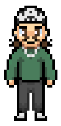
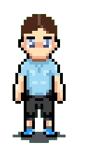
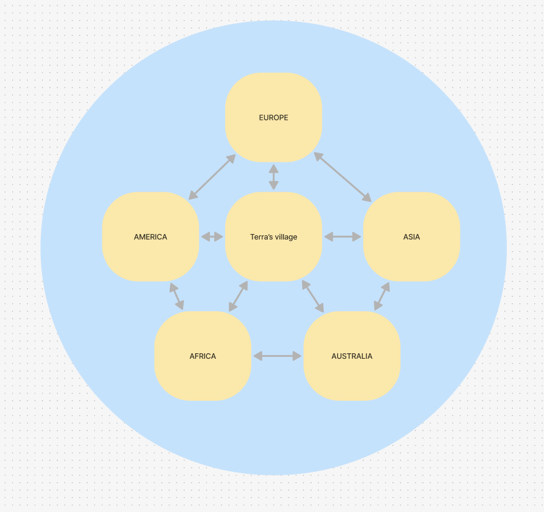
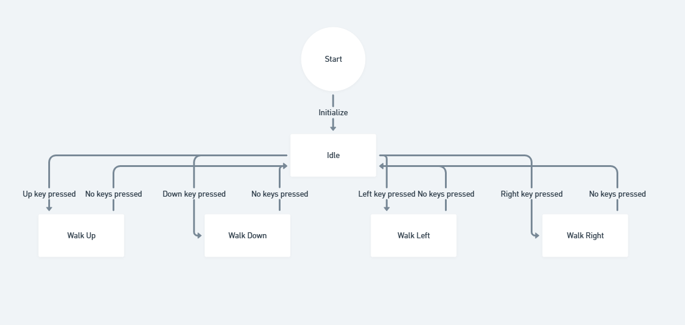

# Technical Specifications - TERRA's Adventures [Team 4]

## Document Control

### Document Information

|                  | Information                                 |
| ---------------- | ------------------------------------------- |
| Document Owner   | Mariem ZAIANE                                |
| Creation Date    | 2024/11/14                                 |
| Last Update Date | 2024/11/29                                  |
| Document Name    | Technical Specifications - TERRA's Adventures [Team 4] |

### Document Version

| Version n° | Author       | Date       | Description of edits |
| ---------- | ------------ | ---------- | -------------------- |
| 0.01       | Mariem ZAIANE | 2024/11/14 | Document skeleton    |
| 0.02       | Mariem ZAIANE | 2024/11/20 | Reworked structure     |
| 0.03       | Mariem ZAIANE | 2024/11/22 | Add technical specifications |
| 1.00       | Mariem ZAIANE | 2024/11/28 | First complete version |
| 1.01       | Mariem ZAIANE | 2024/11/29 | The complete version |

## Table of Contents

<b>Click to expand</b>

- [Technical Specifications - TERRA's Adventures \[Team 4\]](#technical-specifications---terras-adventures-team-4)
  - [Document Control](#document-control)
    - [Document Information](#document-information)
    - [Document Version](#document-version)
  - [Table of Contents](#table-of-contents)
  - [I. Introduction](#i-introduction)
    - [1. Glossary](#1-glossary)
    - [2. Document Purpose](#2-document-purpose)
    - [3. Project Definition](#3-project-definition)
      - [A) Vision](#a-vision)
      - [B) Goals and Objectives](#b-goals-and-objectives)
      - [C) Assumptions](#c-assumptions)
      - [D) Future Improvements](#d-future-improvements)
  - [II. Technology Presentation](#ii-technology-presentation)
    - [1. Development Tools \& Working Environment](#1-development-tools--working-environment)
    - [2. Developer Setup](#2-developer-setup)
    - [3.Sprite Management](#3sprite-management)
    - [A. Sprite Creation:](#a-sprite-creation)
      - [Example Sprites:](#example-sprites)
    - [B. Sprite Formats](#b-sprite-formats)
      - [2D PNG Format:](#2d-png-format)
      - [Custom Sprites:](#custom-sprites)
      - [Open Source Assets:](#open-source-assets)
  - [III. Gameplay Design](#iii-gameplay-design)
    - [1. Core Gameplay Mechanics](#1-core-gameplay-mechanics)
      - [A. User Interface](#a-user-interface)
      - [B. Exploration and Resource Management](#b-exploration-and-resource-management)
  - [IV. Game Narrative and Content](#iv-game-narrative-and-content)
    - [1. Game Logic](#1-game-logic)
    - [2. Movements Logic](#2-movements-logic)
    - [2. Example Of Pilot Phase Focus: Orinya](#2-example-of-pilot-phase-focus-orinya)
  - [V. License (MIT)](#v-license-mit)
  - [VI. Deployment Startegy](#vi-deployment-startegy)
    - [1. Deployment](#1-deployment)
    - [2. Post Deployment / Maintenance Strategy](#2-post-deployment--maintenance-strategy)

## I. Introduction

### 1. Glossary

| Term                | Description                                                                 | Source     |
| ------------------- | --------------------------------------------------------------------------- | ---------- |
| Godot Engine	    |  A cross-platform, free and open-source game engine designed to create both 2D and 3D games targeting PC, mobile, and web platforms. | [Wikipedia](https://en.wikipedia.org/wiki/Godot_(game_engine)) |
| Serious Game                | A serious game or applied game is a game designed for a primary purpose other than pure entertainment. | [Wikipedia](https://en.wikipedia.org/wiki/Serious_game) |
| Climate Change             | Climate change refers to long-term shifts in temperatures and weather patterns. Such shifts can be natural, but since the 1800s, human activities have been the main driver of climate change, primarily due to the burning of fossil fuels like coal, oil and gas. | [United Nations](https://www.un.org/en/climatechange/what-is-climate-change) |
| IDE                 | Integrated Development Environment - Software used for writing, compiling, and debugging code. | [Wikipedia](https://en.wikipedia.org/wiki/Integrated_development_environment) |
| UI	            | In the industrial design field of human–computer interaction, a user interface (UI) is the space where interactions between humans and machines occur. | [Wikipedia](https://en.wikipedia.org/wiki/User_interface#:~:text=In%20the%20industrial%20design%20field,between%20humans%20and%20machines%20occur.)  |
| 	   XP         | An experience point (often abbreviated as exp or XP) is a unit of measurement used in some tabletop role-playing games (RPGs) and role-playing video games to quantify a player character's life experience and progression through the game. | [Wikipedia](https://en.wikipedia.org/wiki/Experience_point)  |
| Sprite	            | In computer graphics, a sprite is a two-dimensional bitmap that is integrated into a larger scene, most often in a 2D video game. | [Wikipedia](https://en.wikipedia.org/wiki/Sprite_(computer_graphics))  |
| NPC                | A non-player character (NPC), also called a non-playable character, is a character in a game that is not controlled by a player. In video games, this usually means a character controlled by the computer (instead of a player) that has a predetermined set of behaviors that potentially will impact gameplay, but will not necessarily be the product of true artificial intelligence. | [Wikipedia](https://en.wikipedia.org/wiki/Non-player_character) |

### 2. Document Purpose

This document expands on the functional specifications of TERRA's Adventures by detailing its features, scope, and objectives. It serves as a guide for the development team and stakeholders, outlining how each feature works and ensuring alignment with the project's goals.

It is recommended to review the Functional Specifications document beforehand.

Key topics include technical requirements, coding conventions, game mechanics, asset integration, and performance optimization, all essential for creating a scalable, maintainable game. The goal is to deliver an engaging serious game that educates players about climate change while providing a solid foundation for future updates.

### 3. Project Definition

#### A) Vision

Our vision is to create a serious game focused on climate change that educates players while remaining engaging and enjoyable. By blending meaningful content with gamified elements like rewards, resource management, mini-games, and quizzes, we aim to strike a balance between education and entertainment, delivering a fun and impactful experience.

#### B) Goals and Objectives

Our primary goal is to develop a serious game targeting middle school students and young adults, aimed at raising awareness and knowledge about climate change issues.

#### C) Assumptions
We assume that the primary users of the game will be young adults. Additionally, we anticipate that the game may be adopted by middle or high schools as an educational tool to support learning about climate change.

#### D) Future Improvements
- **Enhanced Eco-Friendly Features:**
Future updates could make activities like planting trees a core gameplay mechanic to deepen the focus on sustainability.

- **Multiplayer and Real-Time Simulations:**
Adding multiplayer modes or real-time simulations could boost engagement and collaboration.

- **Securing Funding:**
Exploring external funding could help expand the game's reach and features.

## II. Technology Presentation
### 1. Development Tools & Working Environment
To develop the project, we will use a well-equipped working environment. Below are the tools and software we will rely on:

- **Godot Engine:**
Godot Engine is the primary software used to develop the game. We will use the latest stable version available during the project (currently version 4.3). The engine provides all the necessary tools for creating 2D games, including a visual scripting interface and debugging tools.
- **Version Control with Git:**
Visual Studio Code will serve as the code editor for writing GDScript and other scripts used in the game. We will ensure the latest version is installed (currently version 1.89.1) and use relevant extensions for GDScript to enhance productivity.
- **Game Deployment via itch.io:**
itch.io will be used as the platform for deploying and distributing the game. This software allows for seamless uploading, hosting, and sharing of games with a global audience, making it easy to gather feedback and engage with the community.
- **Sound Design Tools:**
Custom sounds for the game are created using **FL Studio** and **Ableton Live**, enabling high-quality audio design tailored to the game's requirements.

### 2. Developer Setup
Below is a detailed overview of the laptop configurations used for development, ensuring compatibility and performance across all devices in the project.
- **For the MacBook Air:**

| **Configuration**     | **Details**                          |
|----------------------|--------------------------------------|
| **Model**           | MacBook Air (13-inch, M3, 2024)      |
| **Chip**            | Apple M3                             |
| **Memory**          | 16 GB                                |
| **Startup Disk**    | Macintosh HD                         |
| **Operating System**| macOS Sequoia 15.1                   |

- **For the first Windows devices:**

| **Configuration**     | **Details**                                      |
|----------------------|--------------------------------------------------|
| **Processor**        | Intel(R) Core(TM) i7-1065G7 CPU @ 1.30 GHz (1.50 GHz) |
| **Memory**           | 16.0 GB                                         |
| **Operating System** | Windows 11 Pro (Build 22000.2538)                |
| **Graphics**         | Intel Iris Integrated Graphics                   |
| **System Type**      | 64-bit OS, x64-based processor                  |

- **For the second Windows device:**

| **Configuration**     | **Details**                                      |
|----------------------|--------------------------------------------------|
| **Processor**        | 13th Gen Intel(R) Core(TM) i7-1355U @ 1.70 GHz   |
| **Memory**           | 16.0 GB (15.7 GB usable)                         |
| **Operating System** | Windows 11 Pro (Version 22H2, Build 22621.4317)  |
| **Graphics**         | Nvidia MX550                                     |
| **System Type**      | 64-bit OS, x64-based processor                   |

### 3.Sprite Management

### A. Sprite Creation:

The sprites in TERRA's Adventures are custom-designed using Aseprite. The game features five NPCs and TERRA, the player character. Each NPC represents a specific continent, drawing inspiration from its cultural and environmental elements. TERRA, in contrast, symbolizes a world free of climate change issues.

#### Example Sprites:

<table>
  <tr>
    <th>NPC 1 (Orynia):</th>
    <th>NPC 2 (Lumora):</th>
    <th>NPC 3 (Novaerica):</th>
    <th>NPC 4 (Zephyra):</th>
    <th>NPC 5 (Solaris):</th>
    <th>TERRA (Player Character)</th>
  </tr>
  <tr>
    <td></td>
    <td></td>
    <td></td>
    <td></td>
    <td></td>
    <td></td>
  </tr>
</table>

### B. Sprite Formats
 All sprites in TERRA's Adventures are designed to be consistent with the game's art style and optimized for seamless integration into the game environment.

#### 2D PNG Format:
All sprites are saved in PNG format with transparent backgrounds. This ensures clean layering and visual consistency across various in-game elements.

#### Custom Sprites:

- **NPCs & Player Character:** TERRA's and NPCs sprites are custom-designed in 32x32 pixels, created pixel by pixel to achieve a unique and cohesive look.
- **Custom Buildings:** Buildings, including TERRA’s house, are constructed using 32x32 pixel building tiles for modularity and ease of reuse in different settings.

#### Open Source Assets:
To supplement custom assets, some sprites were imported from OpenGameArt.org. These assets, created by community artists and available under open-source licenses, were carefully selected to match the game's theme and style. Proper attribution is provided as per the respective licenses.

## III. Gameplay Design

### 1. Core Gameplay Mechanics
  #### A. User Interface
  - **XP points and CO2 Reduction Goals :**
  The player, controlling Terra, will reduce CO2 emissions through actions and mini-games. Each successful action decreases CO2 levels and rewards Terra with XP points.

  **CO2 Reduction:** The CO2 bar displays progress toward the target CO2 reduction.
  **XP Points:** Terra earns XP for every action taken to reduce CO2. Special actions, like quizzes, provide bonus XP.

  **Victory Condition:** The game is won when Terra reaches a specific XP threshold and reduces the global CO2 levels to the target.

  Two bars will be visible on the screen:
  
    - CO2 Bar: Displays CO2 reduction progress.
  
    - XP Bar: Shows the current XP and progress toward the goal.
  
  - **Mini Map :**
      A mini-map is displayed in the top-left corner of the screen. This allows the player to track Terra's location within the game world and provides a fun and useful way to navigate the environment.
  - **inventory :**
      Terra will have an inventory where he can store resources collected throughout the game.

       **Inventory Features:**
      - Terra can store resources in the inventory, organize them, and move them around as needed.
      - Resources can be dropped or used by dragging them to the appropriate spots on the screen.
      - The inventory is accessible via a dedicated button in the UI.

  - **hot bar :**
    The hotbar, located at the bottom of the screen, provides quick access to frequently used resources. The player can select specific resources from the inventory to display in the hotbar, making them easily accessible without needing to open the inventory. This feature ensures a smoother and faster gameplay experience, especially during tasks that require immediate resource use.
  
  - **hints :**
    Hints will appear on the screen periodically to guide the player through the game. These hints provide valuable information, such as what actions to take, where to go next, and how to use resources effectively. Additionally, pop-ups will appear to explain climate change problems and their impact, offering educational insights alongside gameplay guidance.
  #### B. Exploration and Resource Management
  In TERRA's Adventures, exploration and resource management play a vital role in progressing through the game. The player, controlling TERRA, will navigate the game world to discover and collect resources that are essential for solving climate-related challenges.

   - **Resource Collecting**
  
     **Placement Near TERRA’s House:** Some resources will spawn around TERRA’s house on his island, encouraging the player to explore their immediate environment before venturing out to the continents.
    
     **Resource Boxes in Continents:** While traveling to the continents, the player will find resources hidden in boxes scattered across the map. These boxes will require TERRA to interact with them to retrieve the contents.
  - **Interaction Mechanics**
    **Key Input:** The player must press a designated key to collect resources. This mechanic adds an interactive element and ensures the player is actively engaged in exploring their surroundings.
  - **Inventory System**
    - All collected resources are stored in TERRA’s inventory.
    - The inventory is accessible through a dedicated button in the game UI, allowing the player to view, organize, and track the items they have acquired.
    - The player will be able to assign a resource from its inventory into the hotbar placed at bottom of the UI for easier accesss.
  - **Purpose of Resources**
    The resources collected will be needed later to complete specific mini-games or assist NPCs in solving climate change issues. For example:
    - Materials for building solar panels.
    - Seeds for planting specific types of trees.
    - Tools for repairing wind turbines.
- **NPC Interactions and Informative Messages:**
  The game features five NPCs, each representing one of the continents. These NPCs serve as guides to inform Terra about the specific climate change issues faced by their respective regions.

  Whenever Terra enters a continent and interacts with its NPC, a message will pop up above the NPC’s head. This message will provide detailed information about the environmental problems unique to that region. For example, it might describe deforestation in South America, pollution in Asia, or desertification in Africa. These messages are designed to be both informative and educational, ensuring players understand **the real-world challenges linked to climate change**.

  The NPC interactions not only enhance the narrative but also set the stage for the mini-games or actions Terra needs to perform in that continent to help mitigate these issues.
- **Mini-Games for Climate Solutions:**
  The mini-games in TERRA's Adventures serve as interactive representations of real-world actions that can help mitigate climate change. Each continent will feature at least two unique mini-games at least, allowing Terra to explore different solutions to environmental problems. While some mini-games might share similarities, each one is designed to highlight specific climate solutions tailored to the region’s needs.

  When Terra reaches a continent, he will have the option to choose which mini-game to play, allowing him to decide which action to take to help the environment. Through these mini-games, players will learn about the effectiveness of each solution and its impact on climate change. For example, a mini-game in Africa may focus on reforestation, while one in Asia could involve the construction of renewable energy sources.

  By playing these fun and engaging games, Terra not only helps improve the world in the game but also gains valuable insights into how these solutions work in the real world, making learning about climate change both enjoyable and educational.
  
- **Quiz System for Extra XP points:**
  The quiz system in TERRA's Adventures provides players with an opportunity to earn additional XP points. Quizzes will be suggested periodically throughout the game, but completing them is optional. While quizzes are not required to win the game, they offer players a chance to boost their XP when needed.
## IV. Game Narrative and Content
### 1. Game Logic
In TERRA's Adventures, the player controls Terra, a character dedicated to solving climate change issues across the world. Terra is passionate about environmental sustainability and lives in a house designed to be completely climate-change friendly. His home, situated on an island at the center of a small world with five continents, serves as his base of operations. The continents in this world represent the real-world regions of America, Europe, Africa, Asia, and Australia, though they are given unique names to maintain a neutral and educational stance—Novaerica, Zephyra, Lumora, Orynia, and Solaris.

The mission of the game is for Terra to travel from one continent to another, addressing the specific climate change problems each continent faces. Each continent has its own set of environmental challenges that Terra must confront by engaging in mini-games designed to teach real-world solutions.

The game begins at Terra’s house, which is an example of eco-friendly living, and from there, he embarks on a journey to help save the world by reducing CO2 levels and addressing the various climate change issues each continent faces. As Terra interacts with the NPCs and learns about each continent's problems, he will choose from several mini-games that allow him to contribute solutions, like planting trees, building renewable energy sources, or other climate-positive actions.

To win the game, Terra needs to achieve two main objectives:

- Reduce CO2 emissions on each continent.

- Earn a specific amount of XP through actions and mini-games.

The goal is for players to learn about climate change while experiencing the fun and rewarding gameplay of helping Terra save the world.

  

### 2. Movements Logic
- Move Terra using arrow/WASD keys.
    - Press the **W key** (or Up Arrow key) to move **up**.
    - Press the **A key** (or Left Arrow key) to move **left**.
    - Press the **S key** (or Down Arrow key) to move **down**.
    - Press the **D key** (or Right Arrow key) to move **right**.

  

### 2. Example Of Pilot Phase Focus: Orinya
- **Climate Issues Highlighted:**
  
  Orynia (Asia) faces significant climate challenges, including severe pollution and overconsumption of energy. These issues contribute to high levels of CO2 emissions and environmental degradation, necessitating immediate action.
- **Informative Pop-Up Messages:**
  
  When Terra arrives in Orynia, he will meet the continent's NPC, who will provide an overview of the region's climate problems. A pop-up message will explain the pressing issues of pollution and energy inefficiency and emphasize the need for Terra’s help in implementing sustainable solutions.
- **Mini-Games: Building Solar Panels and More:**
  
   To address Orynia’s challenges, Terra will engage in mini-games such as building solar panels to promote renewable energy and planting trees to combat deforestation and air pollution. These activities will not only reduce CO2 emissions but also educate the player on effective climate change solutions.

## V. License (MIT)

The project is licensed under the MIT License. See the [LICENSE](../LICENSE) file for more details.

## VI. Deployment Startegy
### 1. Deployment
The game TERRA's Adventures has been deployed on itch.io, a popular platform for hosting and distributing indie games. Itch.io was chosen for its ease of use, developer-friendly tools, and vibrant gaming community.

**Why Itch.io?**

- **Accessibility:**
 Itch.io allows games to be accessed directly from browsers or downloaded, making it easy for players to engage with the game across multiple platforms.
- **Developer Support:**
 The platform offers intuitive features for uploading, hosting, and managing games, allowing developers to focus on improving gameplay without worrying about technical deployment challenges.
- **Community Engagement:**
 With a dedicated community of indie game enthusiasts, itch.io provides an excellent opportunity to gather feedback and foster a supportive audience for educational games like TERRA's Adventures.
- **Cost-Efficient:**
 Itch.io’s flexible revenue-sharing model ensures affordability for indie developers while maintaining high-quality services.

Deploying on itch.io ensures that TERRA's Adventures reaches a wide audience, promoting awareness of climate change issues in a fun and educational way.
### 2. Post Deployment / Maintenance Strategy
After deploying TERRA's Adventures on itch.io, we will focus on improving the game through regular updates and player feedback. Bug fixes, gameplay enhancements, and content expansion for the remaining continents will keep the game fresh and engaging.

To ensure its long-term success, we’ll optimize performance for various platforms, engage with the player community, and promote the game as an educational tool in schools. This strategy ensures TERRA's Adventures remains relevant, impactful, and enjoyable for all players.
