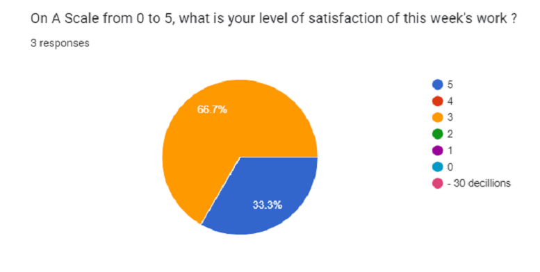

# Weekly Report - Week 5
## Week 5 Objectives
- Helping our Technical Writer to finish his User Manual
- Finishing the main area of the game
- Completing the main features the game used.
## Week 5 Achievements
- Good advancement on the code
- Asia continent is almost done
- started working on africa
## Week 5 Issues and Remarques
Team's satisfaction during this week: 
 

### Issues
Due to the lack of presence of the software engineer, our Technical Writer (who did most of the code with the Program manager) doesn't have his document ready (user manual). We started doing it.
### Remarques
The game is in good shape. With Konstantinos's meeting, the team was reassured about our work. We are in fact in a lead in contrast to the other teams. But the team kept the good spirit and did not lowering his work. 
## Week 6: Objectives for Next Week
- Finish the documents
- Start working on the oral presentation
- Finish at least 2 continents for our MVP.
## Week 5 Conclusion

This week was very effective. We are happy to present this project as we worked hard. Everybody finds his place in this project and we are happy to work. 
The team's satisfaction is very good even if the Software engineer isnt present.