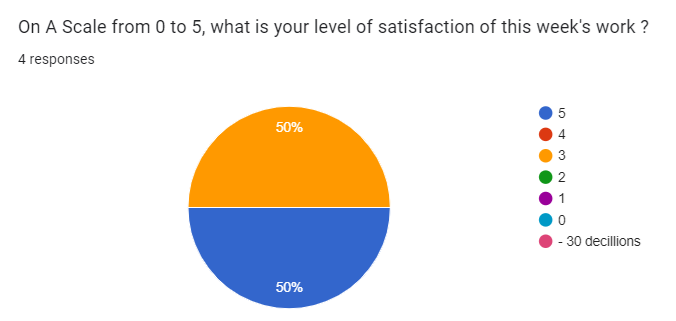

# Weekly Report - Week 6
## Week 6 Objectives
- Finishing the asia continent
- Finishing the musics
- Finishing the game mechanics
- Finishing the UserManual
## Week 6 Achievements
We finished the UserManual of the Technical writter. 
In parallel, The Program manager and Technical writter have made significant progress on the game and we expect to have the asia continent ready for the deadline.
The music is done, our Q.A finished it.
## Week 6 Issues and Remarques
Team's satisfaction during this week: 
 

### Issues
 No real issues have been reported during this week. The team is working correctly compensating the Software engineer's loss.
### Remarques
The software engineer left the school but we were prepared for this. But in result i noticed too much Over time on the project. The total over time hour count would be arround 30 hours in total.
## Week 6: Objectives for Next Week
 
 The code is due at the end of this week. We now have to focus on the presentation of our project.
## Week 6 Conclusion

The team is very happy as the deadline approach and that we are ready for it. 
We need now to focus on the project's presentation due next week.